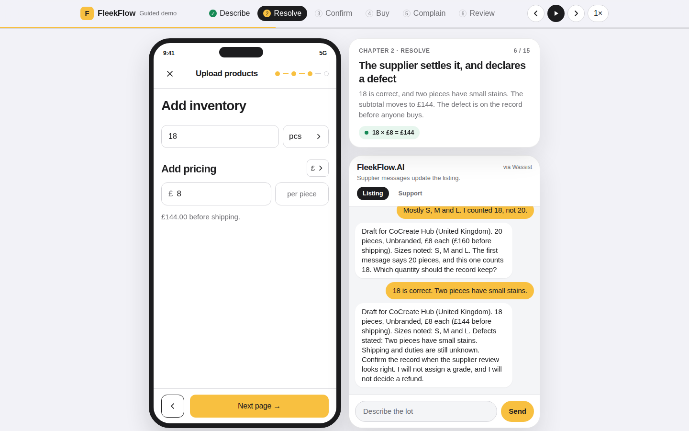

# FleekFlow

A supplier finishes a wholesale lot in conversation. The same confirmed record is what the buyer reads, and what a reviewer uses if the delivery does not match.

## Guided demo

Open [`/demo`](https://fashion-bot-ruddy.vercel.app/demo) for a self-playing walkthrough of the whole path in under two minutes: the supplier describes the lot, a conflicting count is resolved, the record is confirmed, the buyer orders, the client reports a mismatch, and the reviewer receives one draft with the confirmed listing attached.



- It runs on the rule engine in the browser, so it needs no Supabase, Grok, or account, and it plays the same way every time.
- Space plays or pauses, ← and → step through beats, the chapter pills jump, and the speed button cycles 1×, 1.5×, 2×.
- Add `?autoplay` (`/demo?autoplay`) to skip the start card, for a kiosk screen or a screen recording.
- A recording of one full run is in [`pitch/FleekFlow-guided-demo.webm`](pitch/FleekFlow-guided-demo.webm).

The script lives in `lib/demo-script.ts`. Each beat is a caption plus a supplier or client line, replayed through the same `applyVendorMessage`, `confirmRecord`, and `applySupportMessage` functions the live desk uses.

## Run locally

Node.js 20.9 or newer.

```bash
cp .env.example .env.local
npm install
npm run dev
```

Open [http://localhost:3000](http://localhost:3000) for the supplier desk. On a phone, open [http://localhost:3000/phone](http://localhost:3000/phone). After the supplier confirms a lot, open [http://localhost:3000/buy](http://localhost:3000/buy). The buyer can place that order and report a mismatch against the same record. The order exists only after confirmation, and stock is the confirmed quantity.

Fill `.env.local` from `.env.example`:

| Name | Where it is used |
| --- | --- |
| `NEXT_PUBLIC_SUPABASE_URL` | Sessions, lots, and messages |
| `SUPABASE_SECRET_KEY` | Server-only Supabase access |
| `XAI_API_KEY` | Grok replies. If it is missing, the rule engine answers instead |

## Deploy

The app is a Next.js project. Vercel builds it with `npm run build` and deploys every push to `main`.

Set the three variables above for Production and Preview before the first deploy. Do not commit `.env.local`.

Production session cookies are `Secure` and `HttpOnly`. The supplier route allows up to 60 seconds so a Grok reply can finish.

# Product : https://fashion-bot-ruddy.vercel.app/phone

*Demo*: https://youtube.com/shorts/F2QhrB2J-JE?is=2h0qRCPhkVSTIVpG

<!-- impeccable:product-schema 1 -->

Recorded from the existing PRD and the pitch the user asked to present. Open items stay marked.

## Platform

web

## Users

- Supplier. Describes a wholesale lot in conversation and confirms the version that can be read.
- Buyer. Reads that version before deciding and, after delivery, reports the difference.
- Human reviewer. Receives the confirmed listing, the report, and the photos, and decides the case.

## Product Purpose

FleekFlow helps a Fleek supplier finish a wholesale lot in conversation, then keeps that confirmed record for the buyer’s decision and for any later mismatch.

Success for this presentation: a judge understands that one confirmed record serves the purchase and any later mismatch, then watches that path in the demo.

## Positioning

The lot is finished inside the registration sheet, and the sheet shows only what the supplier said. The buyer page is the outcome of that work, not a second product.

## Operating Context

The supplier talks on the Wassist channel beside Fleek’s product-registration sheet. Confirmation is an explicit act. The judges’ interface is English. The bot replies in Portuguese when the supplier writes in Portuguese.

The demonstration lot is CoCreate Hub, United Kingdom, women’s blue shirts, unbranded, £8 each. The supplier states 20, then counts 18, then confirms 18 with two small stains. Subtotal before shipping is £144. The demonstration order is FLK-DEMO-1842.

## Capabilities and Constraints

Each field is declared, confirmed, or unknown. What was not said stays unknown. The product does not assign a grade, prove authenticity, mark a supplier as verified, or decide a refund. A photo can show a missing detail. Shipping and duties stay unknown until the supplier states the amount. A web search enters a draft labeled “found on the web” and does not fill the lot. The purchasable item is created only after “I confirm.” Stock equals the confirmed quantity.

Out of this hack, and not claimed in the pitch: publishing into the live Fleek app, a customs calculator, a verified-supplier badge, a risk score, an authenticity model, piece-by-piece resale listing, and Recharge.

## Brand Commitments

Name: FleekFlow. Primary track: Merchant Tooling. The visual system already recorded in DESIGN.md is binding for this deck: Fleek yellow `#F8C040` only for the action that moves the listing forward, selection green `#178A56`, ink `#1D1D1F`, canvas `#F2F2F7`, Apple system type, 12px fields, hairline borders.

## Evidence on Hand

- `PRD.md` — product rules, demo path, and what the hack does not claim.
- `DESIGN.md` — the registration-sheet visual system.
- `pitch/index.html` — the English spoken pitch this deck presents.
- The running demo in the Next.js app. Reloading clears an in-memory lot; that persistence gap is not a pitch claim.

## Product Principles

- Only stated facts enter the record.
- One confirmed document is what the buyer and the reviewer read.
- A person decides the case. The draft prepares it.
- A more complete lot at the source is the hypothesis. The product does not claim to fix photographing, sourcing, or returns as market shares.


# FleekFlow

A supplier finishes a wholesale lot in conversation. The same confirmed record is what the buyer reads, and what a reviewer uses if the delivery does not match.

## Run locally

Node.js 20.9 or newer.

```bash
cp .env.example .env.local
npm install
npm run dev
```

Open [http://localhost:3000](http://localhost:3000) for the supplier desk. On a phone, open [http://localhost:3000/phone](http://localhost:3000/phone). After the supplier confirms a lot, open [http://localhost:3000/buy](http://localhost:3000/buy). The buyer can place that order and report a mismatch against the same record. The order exists only after confirmation, and stock is the confirmed quantity.

Fill `.env.local` from `.env.example`:

| Name | Where it is used |
| --- | --- |
| `NEXT_PUBLIC_SUPABASE_URL` | Sessions, lots, and messages |
| `SUPABASE_SECRET_KEY` | Server-only Supabase access |
| `XAI_API_KEY` | Grok replies. If it is missing, the rule engine answers instead |

## Deploy

The app is a Next.js project. Vercel builds it with `npm run build` and deploys every push to `main`.

Set the three variables above for Production and Preview before the first deploy. Do not commit `.env.local`.

Production session cookies are `Secure` and `HttpOnly`. The supplier route allows up to 60 seconds so a Grok reply can finish.
